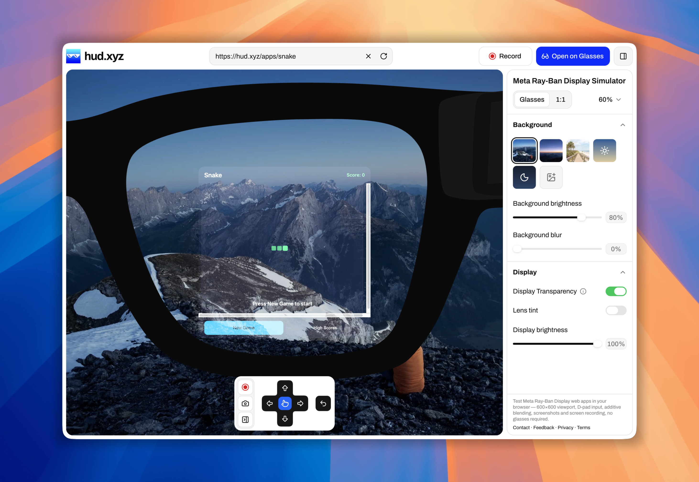

# hud.xyz

Browser-based simulator for the Meta Ray-Ban Display. Build and preview glasses apps in a faithful 600×600 surface with D-pad input, without the hardware.

Live: [hudxyz.com](https://hudxyz.com)



## Features

- **Preview any URL**: paste a web app and preview it on the glasses surface
- **Realistic additive display**: preview how UI reads on the waveguide (white opaque, black transparent)
- **Glasses or 1:1 mode**: toggle frame chrome vs the exact 600×600 pixel view
- **Screen recording**: capture full-HD demos from the browser (Chrome; Firefox/Safari soon)
- **Live video backgrounds**: street, driving, and outdoor scenes behind the lens
- **Open on Glasses**: QR deeplink that opens your app on the real Meta Ray-Ban Display
- **Day / night environments**: check contrast indoors and outside

## Dev

```sh
pnpm install
pnpm dev
```

Requires Node ≥ 22.12. App lives in `apps/web`.
