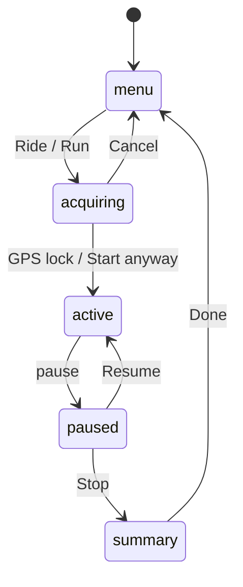

# Activity Tracker lens (`/speedometer`)

GPS run/ride tracker for the Meta Ray-Ban Display. Single-page state machine, mode-aware glance UI, in-memory only (v1).

> File is `_README.md` (underscore prefix) so Astro does **not** turn it into a route — anything else in `src/pages/` with a `.md`/`.astro` extension becomes a published page. Keep docs underscore-prefixed.

## Why it's shaped this way

The Display is a 600×600 additive waveguide driven by a D-pad (**Arrow keys + Enter only** — no reliable Escape), with **no pointer, no text input, and no back-navigation**. See the repo-root `CLAUDE.md` "Device constraints" + "Interaction model" for the full rules. Two consequences drive this lens:

- **No routes.** Because back-nav is unsupported, screens can't be separate pages/`history.back()`. The whole lens is one document; "screens" are toggled by a `data-state` attribute on `#app`.
- **Arrows + Enter only.** The device emits no dependable Escape, so every action is a focusable control reached by arrows and activated by Enter — e.g. pausing reveals on-screen Resume/Stop buttons rather than relying on an Escape key.
- **GPS + a timer is all we get.** Heart rate, power, cadence, calories need sensors the WebApp sandbox can't reach, so they don't exist here. Everything shown is derived from `navigator.geolocation` + an elapsed clock.

## State machine

Every transition is **Enter on a focusable control** (arrows move focus). There is **no Escape** — the device doesn't emit it (see repo `CLAUDE.md`).

`setState(next)` writes `#app[data-state]`; CSS shows the matching `.s-*` section. `active` and `paused` share `.s-active` (paused dims the hero, freezes the clock, and shows "PAUSED" in the status line; the topbar otherwise shows the mode label + live GPS accuracy). The footer swaps the legend (active) for the Resume/Stop buttons (paused).

| State | Screen | Focusable controls | Keys |
|---|---|---|---|
| `menu` | `.s-menu` | Ride / Run | ↑/↓ focus · Enter = start (fires GPS permission) |
| `acquiring` | `.s-acquiring` | Start anyway / Cancel | ↑/↓ focus · Enter = select; auto-advances on lock |
| `active` | `.s-active` | none (glance screen) | Enter = pause · ←/→ = cycle highlighted stat |
| `paused` | `.s-active` (footer) | Resume / Stop | ↑/↓ focus · Enter = select |
| `summary` | `.s-summary` | Done | Enter = back to menu |

`Enter` on Ride/Run is also the **permission gesture**: it runs `start()` → `watchPosition()` synchronously inside the keypress, which is what lets the geolocation prompt fire.

## Acquiring (why the clock waits)

The clock and accumulators **do not start until GPS locks** — otherwise a cold first fix makes the timer run against no signal. After Ride/Run, the lens enters `acquiring`: `watchPosition` is live and each fix is gated by `onPos`. It locks (→ `enterActive()`, which resets accumulators and sets `activeSince`) once `ACQUIRE_STABLE_FIXES` fixes arrive at `accuracy ≤ ACQUIRE_ACCURACY_M`. The screen shows elapsed acquire time + live accuracy; **Start anyway** skips the wait (weak lock), **Cancel** returns to menu. Every fix, lock, error, and transition is `console.log`'d under the `[tracker]` prefix — filter on that when debugging a slow lock.

## Stats — mode flips the hero

| | Hero | Secondary cells (DIST · TIME · AVG · MAX) |
|---|---|---|
| **Ride** | current **speed** `km/h` | distance · elapsed · avg speed · max speed |
| **Run** | current **pace** `/km` | distance · elapsed · avg pace · best pace |

`←/→` moves a highlight (`.is-sel`, accent color) across the four secondary cells; it does **not** change units (units live in Settings, v2+).

## Module structure

DOM-free logic (reusable, package-ready) is split from the thin view:

- `lib/kalman.ts` — `SpeedKalman`, the 1-D speed filter.
- `lib/geo.ts` — `haversine`.
- `lib/format.ts` — display formatters (`fmtTime` / `fmtDist` / `fmtPace` / `kmh`).
- `lib/dpad.ts` — shared d-pad focus navigation (`focusFirst` / `moveFocus` / `handleListNav`), used by every lens.
- `lib/tracker.ts` — `Tracker`: state machine + accumulators + GPS watch, **no DOM**. Drive with `start()` / `pause()` / `resume()` / `stop()` / `skipAcquire()` / `cancel()` / `cycleSecondary()`; read `snapshot()`; re-render via the `onChange` callback.
- `components/Speedometer.tsx` — the **view**: a Solid component (inline Tailwind + reactive), subscribes to the `Tracker` via a `snapshot()` signal. No domain logic.
- `index.astro` — hosts the view as a `client:load` Solid island inside `Layout`.

Styling: shared primitives (`.opt`, `.opts`, `.title`, `.subtitle`, `.hint`, `.stat*`) come from `@lenswolf/ui/glasses.css`; the lens `<style>` holds only its own layout + `[data-state]` rules.

## Data model & formulas

`Tracker` holds the accumulators (reset in `enterActive()`), exposed as a `TrackerSnapshot`:

- **distance** (`distanceM`) — sum of `haversine()` between consecutive fixes, gated to reject jitter/teleports: only added when `dt > 0`, `accuracy < 50 m`, and `0.5 m < step < 200 m`.
- **current speed** (`speedMs`, m/s) — prefers `coords.speed` (Doppler); falls back to `Δdistance/Δt` when it's `null` (it often is). Sub-`0.5 m/s` is zeroed, then a 1-D **Kalman filter** (`SpeedKalman` in `lib/kalman.ts`) smooths it and rejects spikes, weighting each measurement by its GPS accuracy. Filter output below `0.3 m/s` reads 0.
- **max** (`maxMs`) — running max of `speedMs`. For run this is also "best pace" (fastest = highest speed).
- **elapsed** — banked across pauses: `elapsedMs = bankedMs + (active ? now - activeSince : 0)`. Pause adds the live stretch to `bankedMs`; resume restarts `activeSince` and clears `lastFix` so the gap doesn't add phantom distance.
- **avg** — `distanceM / elapsedSeconds`, rendered as km/h (ride) or pace (run).
- **pace** — `1000 / (m/s)` = seconds per km → `m:ss`; shows `--:--` below 0.3 m/s.

### Tuning knobs

| Knob | Value | Effect |
|---|---|---|
| Kalman `q` (process noise) | `0.6` | higher = snappier hero, lower = smoother |
| Kalman `r` (measurement noise) | `4` | higher = more smoothing; auto-scaled up by GPS accuracy |
| standstill cutoff | `0.5 m/s` | raw speed below is zeroed before filtering |
| accuracy gate | `< 50 m` | fixes worse than this don't add distance |
| step bounds | `0.5–200 m` | rejects jitter (too small) and teleports (too big) |
| GPS timeout | `15000 ms` | first fix is slow; Meta recommends 10–15 s |
| `ACQUIRE_ACCURACY_M` | `25 m` | a fix must be this accurate to count toward lock |
| `ACQUIRE_STABLE_FIXES` | `2` | good fixes required before tracking starts |

## Conventions

- Focusable elements use the **`data-focusable` attribute**, not Meta's `.focusable` class (repo convention — translate sample code).
- Colors come from `@lenswolf/ui` tokens: `--color-canvas` (black = transparent), `--color-ink` (white = opaque), `--color-accent` (`#CEFF00`). Don't hardcode hexes.
- When persistence lands, **namespace localStorage keys** (`lenswolf:speedo:*`) — all lenses share one origin's storage.

## Roadmap

v1 (current): state machine, run/ride, mode-aware glance, GPS-lock acquiring, Kalman-smoothed speed, **in-memory, metric only**.

- **v2** — persist config (units, default mode) + save session summaries to `localStorage`; "Last: 5.2 km · 28:30" on the menu; imperial units.
- **v3** — auto-pause when speed ≈ 0; per-km auto-lap with lap-pace flash.
- **v4** — preset distance/time goals + progress-ring indicator.
- **v5+** — session-history view, GPS track save, splits/export (mind the 5 MB cap).

## Testing

- **Desktop preview** (`pnpm dev`, then `/speedometer`): `coords.speed` is `null` and you aren't moving, so the hero reads **0 / `--:--`**. This validates the state machine, focus, permission prompt, and layout — but not real speed.
- **Real numbers** need movement: load the ngrok HTTPS URL on the phone/glasses and walk or drive.
- "Location denied" → clear the site's location permission and press Start again (the prompt only fires on that gesture).
